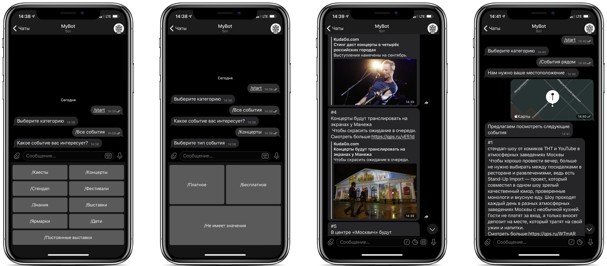

## Implementation of KudaGo telegram bot

### Control is performed via a text and button interface:
* `/Events nearby` - uses geolocation to find nearby events
* `/All events` - provides a selection from the category: Quests, Concerts, etc.
* `/Paid` - select only paid events
* `/Free` - select only free events
* `/Doesn't matter` - select the most interesting events
