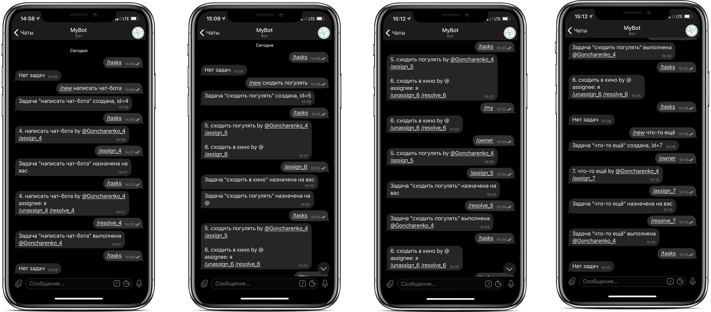

## Implementation of a telegram bot for task management

### Control is performed via a text interface:
* `/tasks`
* `/new XXX YYY ZZZ` - creates a new task
* `/assign_$ID` - assigns the user to the task
* `/unassign_$ID` - unassigns the current assignee from the task
* `/resolve_$ID` - performs the task, removes it from the list
* `/my` - shows the tasks that are assigned to me
* `/owner` - shows the tasks that were created by me

Using a fixed library to work with a telegram bot allows us to write tests as if we were a telegram server. It is located in the `vendors` folder.
Run tests with `go test -v -mod=vendor`.

The chatbot can be launched in 2 variants:
1. `ngrok` (https://ngrok.com/) - sends the port to you (after authorization, there will be a command to save the token in the config). Most likely, it will not work because of [Federal Service for Supervision of Communications, Information Technology and Mass Media](https://en.wikipedia.org/wiki/Federal_Service_for_Supervision_of_Communications,_Information_Technology_and_Mass_Media).
2. `heroku` (https://devcenter.heroku.com/articles/getting-started-with-go) - provides free hosting for Golang with a subdomain and a certificate that can be connected to Telegram.
